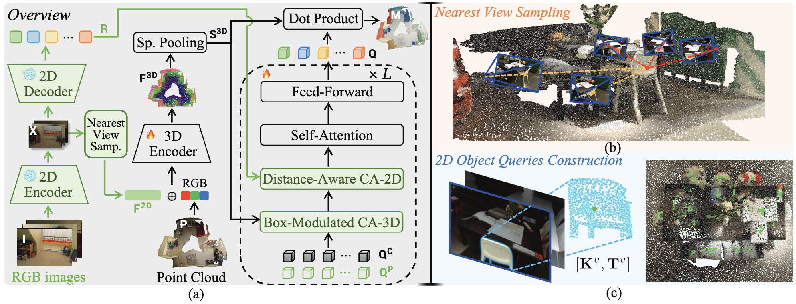
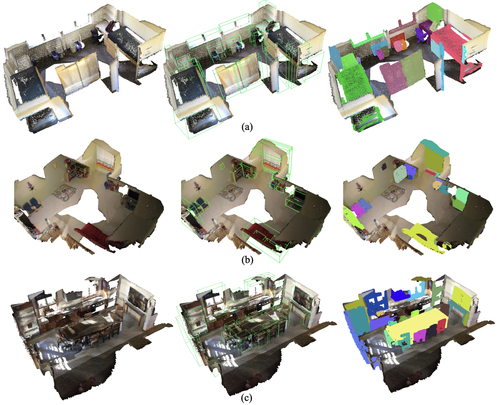

<div align="center">
  
</div>

# SegDINO3D: 3D Instance Segmentation Empowered by Both Image-Level and Object-Level 2D Features

Authors: [Jinyuan Qu](https://scholar.google.com/citations?user=-RSeOl0AAAAJ&hl), [Hongyang Li](https://scholar.google.com.hk/citations?view_op=list_works&hl=zh-CN&user=zdgHNmkAAAAJ&gmla=AMpAcmTJNHoetv6zgfzZkIRcYsFr0UkGGDyl5tAp5etuBqhz3lzYZCQrVDot02xVQ1XTbnMS1fPdAfe0-2--aTXOtewokjyShNLOQQyyhtkolwaz0hvENZpi-pJ-Wg), [Xingyu Chen](https://scholar.google.com/citations?user=YurWtIEAAAAJ&hl), [Shilong Liu](https://scholar.google.com/citations?hl=zh-CN&user=nkSVY3MAAAAJ), [Yukai Shi](https://scholar.google.com/citations?user=oQXfkSQAAAAJ&hl), [Tianhe Ren](https://scholar.google.com.hk/citations?user=cW4ILs0AAAAJ&hl=zh-CN&oi=sra), Ruitao Jing and [Lei Zhang](https://scholar.google.com/citations?hl=zh-CN&user=fIlGZToAAAAJ).

<div align="center">

[](https://arxiv.org/abs/2509.16098)
[](https://idea-research.github.io/SegDINO3D/)
[](https://huggingface.co/datasets/JinyuanQu/SegDINO3D)
[](https://github.com/IDEA-Research/SegDINO3D)



</div>

## Installation

Please follow our installation [guidance](installation.md) to prepare dependencies.
After downloading and processing the data, place it in the `./data/` directory.

## Data Preparation

1. For ScanNet and ScanNet200 datasets preprocessing please follow the [instruction](data/readme.md).

2. We provide the DINO-X features required for training and evaluation, which are available for download on [Hugging Face](https://huggingface.co/datasets/JinyuanQu/SegDINO3D).
After downloading, please place them in the `./data/features_2d/` directory.

The directory structure after data preparation should be as below:

```shell
data
├── features_2d/
│   ├── scannet/
│   ├── scannet200/
├── scannet/
├── scannet200/
├── readme.md
```

## Evaluation

First, download our provided [checkpoints](https://drive.google.com/drive/folders/1TXhA02XOwIQcVl_A0mWDBsn0Z2WI2Wx5?usp=drive_link), and put them at "./checkpoint".

```shell
# Select the dataset you want to evaluate in eval.sh manually.
bash scripts/eval.sh
```

## Training

For training on ScanNet200, please prepare the pretrained backbone "mask3d_scannet200_aligned.pth" and put it to ./pretrained_backbone before training. The backbone is initialized from [Mask3D](https://github.com/JonasSchult/Mask3D) checkpoint and can be downloaded [here](https://drive.google.com/drive/folders/1I6l8yBqMluAduMyzxD8ThnVOdpuWt3_r?usp=drive_link).

For training on ScanNet, please prepare the pretrained backbone "aligned_sstnet_scannet.pth" and put it to ./pretrained_backbone before training. The backbone is initialized from [SSTNet](https://github.com/Gorilla-Lab-SCUT/SSTNet) checkpoint and can be downloaded [here](https://drive.google.com/drive/folders/1I6l8yBqMluAduMyzxD8ThnVOdpuWt3_r?usp=drive_link).

```shell
# Select the dataset used for training in train.sh manually.
bash scripts/train.sh
```

## Models

We provide the configuration files and checkpoints for the ScanNet and ScanNet200 benchmarks (validation set), using [DINO-X](https://github.com/IDEA-Research/DINO-X-API) as the 2D detection model to provide 2D features.

| Dataset | mAP | mAP<sub>50</sub> | mAP<sub>25</sub> | Download |
|:-------:|:---:|:----------------:|:----------------:|:--------:|
| ScanNet (val) | 64.0 | 81.5 | 88.9 | [model](https://drive.google.com/file/d/1fOHpylCGjZy_tzVLO64LqWTOO61knr69/view?usp=drive_link) &#124; [config](configs/prototypes/SegDINO3D_ScanNetv2.py)|
| ScanNet200 (val) | 40.2 | 52.4 | 58.6 | [model](https://drive.google.com/file/d/1yo-R8NjEnA6AmVUzOds4q57kgKBboN_o/view?usp=drive_link) &#124; [config](configs/prototypes/SegDINO3D_ScanNet200.py) |

Additionally, our performance on the ScanNet200 hidden test set is shown below:

| Dataset | mAP | mAP<sub>50</sub> | mAP<sub>25</sub> | Details |
|:-------:|:---:|:----------------:|:----------------:|:--------:|
| ScanNet200 (test) | 34.6 | 45.4 | 51.1 | [details](https://kaldir.vc.in.tum.de/scannet_benchmark/result_details?id=2451) |

## Qualitative Performance

<div align="center">
  
</div>

## Ciatation

If you find this work helpful for your research, please cite:

```text
@inproceedings{qu2025segdino3d,
  title={{SegDINO3D: 3D Instance Segmentation Empowered by Both Image-Level and Object-Level 2D Features}},
  author={Qu, Jinyuan and Li, Hongyang and Chen, Xingyu and Liu, Shilong and Shi, Yukai and Ren, Tianhe and Jing, Ruitao and Zhang, Lei},
  booktitle={Association for the Advancement of Artificial Intelligence (AAAI)},
  year={2026},
}
```

## Acknowledgement

We would like to thank the authors of the following projects for their excellent work:

- [DINO-X](https://github.com/IDEA-Research/DINO-X-API) - DINO-X: A Unified Vision Model for Open-World Object Detection and Understanding
- [Grounding DINO](https://github.com/IDEA-Research/GroundingDINO) - Grounding DINO: Marrying DINO with Grounded Pre-Training for Open-Set Object Detection
- [OneFormer3D](https://github.com/filaPro/oneformer3d) - OneFormer3D: One Transformer for Unified Point Cloud Segmentation
- [DAB-DETR](https://github.com/IDEA-Research/DAB-DETR) - DAB-DETR: Dynamic Anchor Boxes are Better Queries for DETR
- [SPFormer](https://github.com/sunjiahao1999/SPFormer) - Superpoint Transformer for 3D Scene Instance Segmentation
- [Mask3D](https://github.com/JonasSchult/Mask3D) - Mask3D: Mask Transformer for 3D Instance Segmentation
- [MAFT](https://github.com/dvlab-research/Mask-Attention-Free-Transformer) - Mask-Attention-Free Transformer for 3D Instance Segmentation
- [3DETR](https://github.com/facebookresearch/3detr) - 3DETR: An End-to-End Transformer Model for 3D Object Detection
